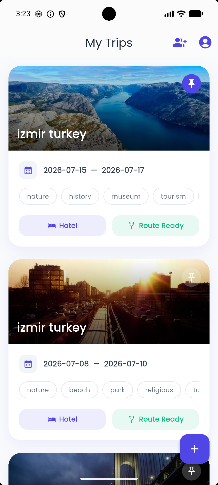
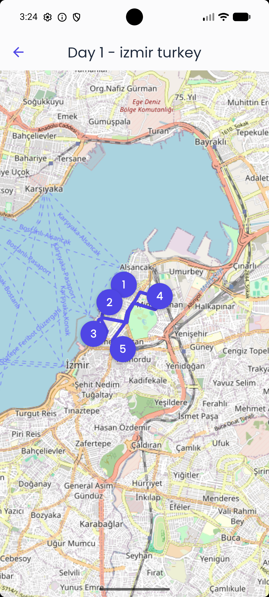
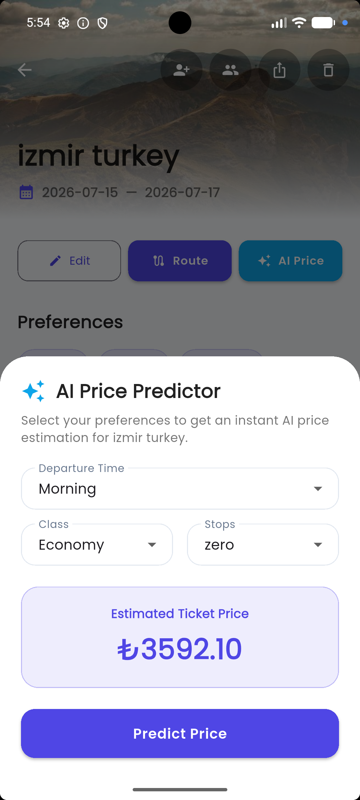

# AI Travel Itinerary Optimizer

AI Travel Itinerary Optimizer is a full-stack, intelligent travel planning application that helps users create highly personalized multi-day travel routes. It considers destination, travel dates, hotel location, user preferences, weather conditions, dynamic distances, and autonomous flight price predictions to generate the optimal travel experience.

The project is engineered with a powerful Django REST backend, utilizing MySQL and LightGBM for machine learning, seamlessly integrated with a modern Flutter mobile application.

---

# Project Overview

This application empowers travelers to:

- Register and manage secure accounts with JWT authentication.
- Create and organize detailed upcoming trips.
- Select from diverse travel preferences (e.g., Nature, History, Museum, Beach).
- Geocode hotel information automatically.
- Generate optimized daily travel routes autonomously using graph-based algorithms.
- Predict flight prices dynamically using an AI model (LightGBM).
- Export complete travel itineraries as professionally formatted PDF documents.
- Edit or regenerate routes whenever trip information changes.

---

## 📱 Application Screenshots

| My Trips | AI Route Generator | Day Map View | AI Flight Price |
| :---: | :---: | :---: | :---: |
|  |  |  |  |

---

# Core Features

## 🔐 Authentication & Security

- Secure user registration and login.
- JWT authentication using Django Simple JWT.
- Secure token storage on mobile using `flutter_secure_storage`.
- Environment variable management using `python-dotenv` and `flutter_dotenv`.

---

## 🧳 Trip Management

- Full CRUD operations for trips.
- Hotel and destination autocomplete using Geoapify.
- Automatic hotel geocoding.
- Date range picker for travel dates.
- Edit existing trips.
- Automatic route regeneration after trip updates.

---

## 🧠 AI Route Generation & Optimization

- Graph-based itinerary optimization.
- Recommendation scoring based on user preferences.
- Daily time-window optimization.
- Multiple travel pace modes:
  - Relaxed
  - Balanced
  - Discovery
- Weather-aware route planning using Open-Meteo API.
- Indoor attractions prioritized during rainy weather.
- Drag-and-drop daily itinerary reordering.

---

## ✈️ AI Flight Price Prediction

- Current location detection using GPS.
- Destination geocoding.
- Distance calculation using the Haversine Formula.
- Flight price prediction using a trained LightGBM regression model.
- Prediction based on:
  - Distance
  - Days before departure
  - Flight class
  - Number of stops

---

## 🗺 Maps & Visualization

- Interactive maps using `flutter_map`.
- Route visualization using the OSRM Routing API.
- Place markers.
- Daily travel path visualization.

---

## 📄 PDF Export

- Export complete travel itineraries.
- Weather information included.
- Daily schedules included.
- Share generated PDF using the native sharing menu.

---

# Tech Stack

## Backend

- Python
- Django
- Django REST Framework
- MySQL
- LightGBM
- Scikit-learn
- Pandas
- Simple JWT
- python-dotenv
- django-cors-headers

---

## Mobile

- Flutter
- Dart
- Provider
- flutter_secure_storage
- shared_preferences
- flutter_map
- geolocator
- geocoding
- latlong2
- pdf
- printing
- http

---

## External APIs

- Geoapify Places API
- Open-Meteo Weather API
- OSRM Routing API
- Nominatim OpenStreetMap

---

# Project Structure

```text
Travel_App
├── backend
│   ├── accounts
│   ├── api
│   ├── config
│   ├── external_services
│   ├── flights
│   ├── ml_model
│   ├── places
│   ├── route_optimizer
│   ├── trips
│   ├── weather
│   ├── manage.py
│   └── requirements.txt
│
├── mobile
│   └── travel_planner_app
│       ├── android
│       ├── ios
│       ├── lib
│       │   ├── core
│       │   ├── features
│       │   └── main.dart
│       └── pubspec.yaml
│
└── docs
    ├── algorithms
    ├── api
    ├── architecture
    ├── database
    └── roadmap
```

---

# Setup Instructions

## 1. Backend Setup

### Create a Virtual Environment

```bash
python -m venv .venv
```

### Activate Virtual Environment

Windows

```bash
.venv\Scripts\activate
```

macOS/Linux

```bash
source .venv/bin/activate
```

### Install Dependencies

```bash
cd backend
pip install -r requirements.txt
```

### Configure Environment Variables

Create a `.env` file inside the **backend** directory.

```env
SECRET_KEY=your-django-secret-key
DEBUG=True

DB_NAME=ai_travel_planner
DB_USER=root
DB_PASSWORD=your_mysql_password
DB_HOST=localhost
DB_PORT=3306

ALLOWED_HOSTS=127.0.0.1,localhost

GEOAPIFY_API_KEY=your_geoapify_api_key
```

### Run Migrations

```bash
python manage.py makemigrations
python manage.py migrate
```

### Start the Backend

```bash
python manage.py runserver
```

Backend URL:

```
http://127.0.0.1:8000
```

---

## 2. Flutter Mobile Setup

Navigate to the Flutter project.

```bash
cd mobile/travel_planner_app
```

Install packages.

```bash
flutter pub get
```

---

### Configure API Base URL

Open:

```
lib/core/constants/api_constants.dart
```

Android Emulator

```dart
http://10.0.2.2:8000
```

Chrome / iOS Simulator

```dart
http://127.0.0.1:8000
```

Physical Android Device (same Wi-Fi)

```dart
http://YOUR_COMPUTER_IP:8000
```

---

### Flutter Environment Variables

If required, create a `.env` file inside:

```
mobile/travel_planner_app/
```

---

### Run Flutter

```bash
flutter run
```

---

# Test Scenario

### 1. Register or Login

Create a new account or login.

---

### 2. Create a Trip

Destination

```
Paris, France
```

Dates

```
3 days next week
```

Hotel

```
Hilton Paris Opera
```

Preferences

```
History
Museum
Cafe
```

---

### 3. Open Trip Detail

Select the created trip.

---

### 4. Generate Route

Choose:

```
Discovery
```

Generate the itinerary.

---

### 5. View Map

Open a generated day and press:

```
View on Map
```

The application displays the optimized route using OSRM.

---

### 6. AI Flight Price

Press:

```
AI Price
```

The application will:

- Get your GPS location
- Calculate the travel distance
- Predict the flight price using the LightGBM model

---

### 7. Export PDF

Press the Share button.

The application generates a travel itinerary PDF.

---

# Author

**Akif Özdemir**

**GitHub**

https://github.com/akfoz45

**LinkedIn**

https://www.linkedin.com/in/akfozdemir/