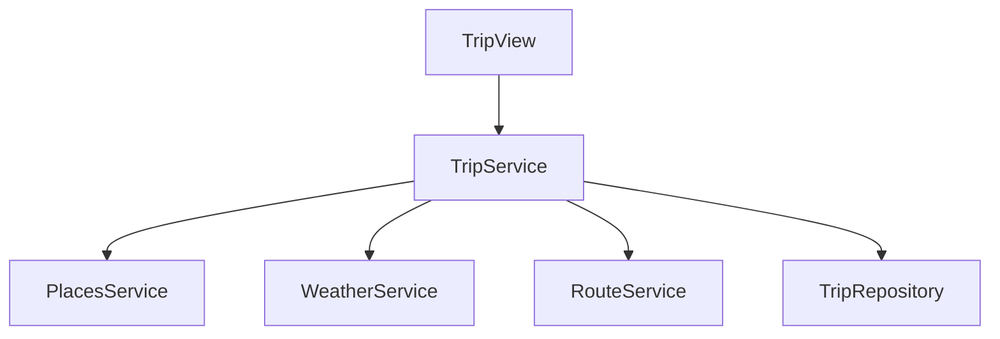

# Component Diagram

## Purpose

This diagram describes the internal components of the backend.

## Description

The View layer receives requests.

The Service layer contains business logic.

Repositories communicate with database models.

Dedicated services interact with external APIs and optimization algorithms.
