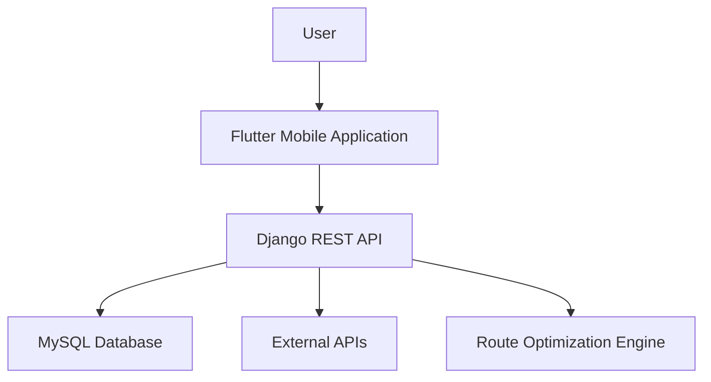

# Container Diagram

## Purpose

This diagram describes the main containers of the system.

## Description

The Flutter application communicates with the Django REST backend.

The backend:

* Stores data in MySQL.
* Requests information from external APIs.
* Sends place data to the Route Optimization Engine.
* Returns JSON responses to the mobile application.
