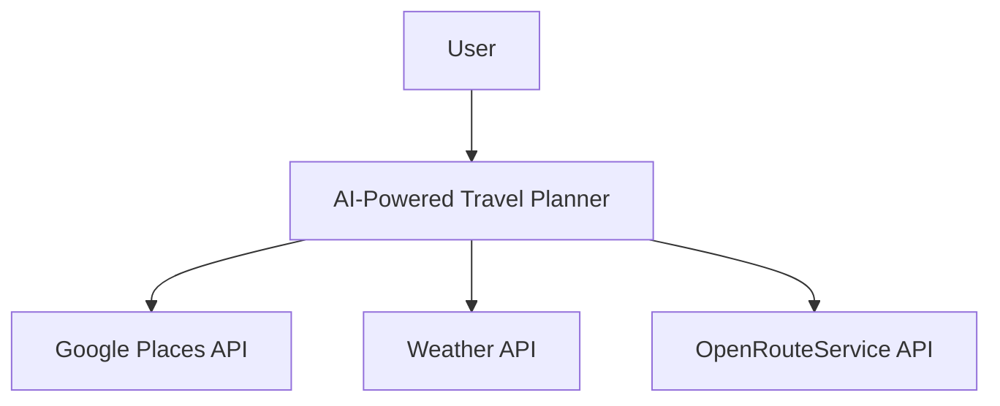

# Context Diagram

## Purpose

This diagram describes the external actors and systems interacting with the AI-Powered Travel Planner.

## Description

The user interacts with the AI-Powered Travel Planner.

The application communicates with external services:

* Google Places API
* Weather API
* OpenRouteService API

These services provide location, weather, and routing information used to generate optimized travel plans.
