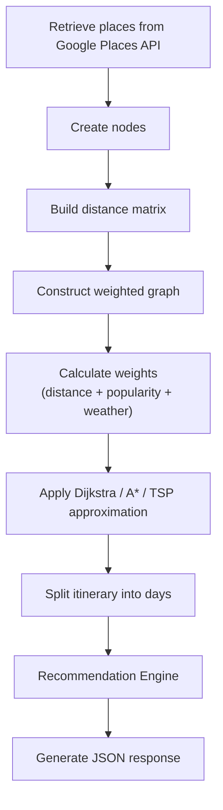

# Route Optimization Flow

## Purpose

This module generates optimized travel itineraries using graph algorithms.

## Optimization Criteria

* Travel distance
* Place popularity
* User preferences
* Weather conditions
* Available time
