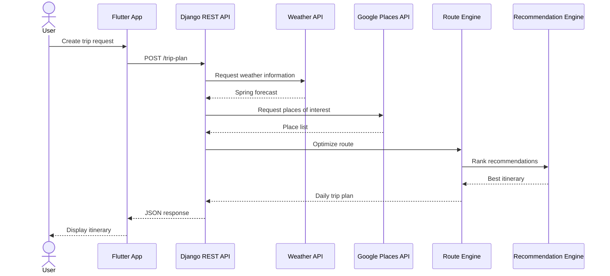

# Sequence Diagram

```mermaid
sequenceDiagram

actor User

participant Mobile as Flutter App
participant Backend as Django REST API
participant Weather as Weather API
participant Places as Google Places API
participant Optimizer as Route Engine
participant AI as Recommendation Engine

User->>Mobile: Create trip request

Mobile->>Backend: POST /trip-plan

Backend->>Weather: Request weather information
Weather-->>Backend: Spring forecast

Backend->>Places: Request places of interest
Places-->>Backend: Place list

Backend->>Optimizer: Optimize route

Optimizer->>AI: Rank recommendations

AI-->>Optimizer: Best itinerary

Optimizer-->>Backend: Daily trip plan

Backend-->>Mobile: JSON response

Mobile-->>User: Display itinerary
```
