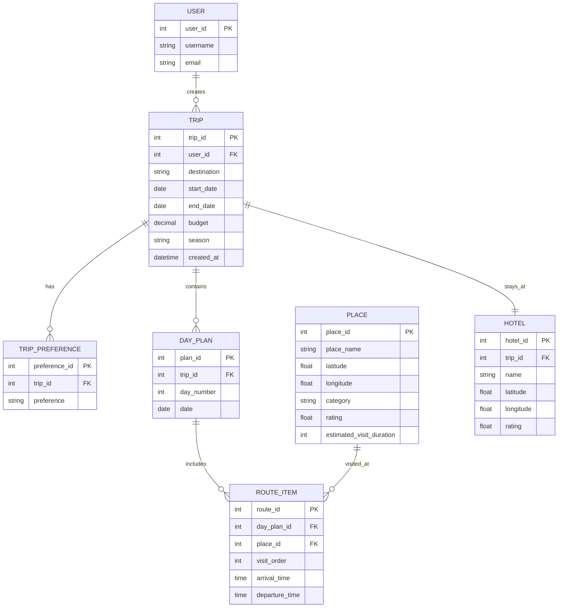

# Database Schema

## Purpose

This document defines the initial database schema for the AI-Powered Travel Planner project.

The database will store users, trips, daily plans, places, route items, preferences, and hotel information.

The project will use **MySQL** as the relational database.

---

## Entity Relationship Diagram



---

## Tables

## User

Stores registered users.

In the actual Django implementation, Django's built-in authentication system will manage password hashing and authentication fields.

| Field    | Type    | Description        |
| -------- | ------- | ------------------ |
| id       | integer | Primary key        |
| username | string  | Unique username    |
| email    | string  | User email address |

---

## Trip

Stores the main travel plan created by a user.

Example:

> 3-night Montenegro trip in spring

| Field       | Type     | Description                  |
| ----------- | -------- | ---------------------------- |
| id          | integer  | Primary key                  |
| user_id     | integer  | Foreign key referencing User |
| destination | string   | Travel destination           |
| start_date  | date     | Trip start date              |
| end_date    | date     | Trip end date                |
| budget      | decimal  | Optional budget value        |
| season      | string   | Travel season                |
| created_at  | datetime | Creation timestamp           |

---

## TripPreference

Stores user preferences for a trip.

This keeps preferences normalized instead of storing comma-separated values inside the Trip table.

Examples:

* Nature
* History
* Food
* Beach
* Culture

| Field      | Type    | Description                         |
| ---------- | ------- | ----------------------------------- |
| id         | integer | Primary key                         |
| trip_id    | integer | Foreign key referencing Trip        |
| preference | string  | Selected or entered user preference |

---

## DayPlan

Stores each day of a trip.

A 3-night trip usually creates 4 DayPlan records.

| Field      | Type    | Description                  |
| ---------- | ------- | ---------------------------- |
| id         | integer | Primary key                  |
| trip_id    | integer | Foreign key referencing Trip |
| day_number | integer | Day index of the trip        |
| date       | date    | Calendar date of the day     |

---

## Place

Stores travel locations retrieved from external APIs or saved in the system.

Each place acts as a graph node in the route optimization process.

| Field                    | Type    | Description                         |
| ------------------------ | ------- | ----------------------------------- |
| id                       | integer | Primary key                         |
| name                     | string  | Place name                          |
| latitude                 | float   | Geographic latitude                 |
| longitude                | float   | Geographic longitude                |
| category                 | string  | Place category                      |
| rating                   | float   | Popularity or quality score         |
| estimated_visit_duration | integer | Estimated visit duration in minutes |

---

## RouteItem

Stores the ordered places inside a DayPlan.

This table represents the actual route sequence for each day.

Each RouteItem connects a DayPlan with a Place.

| Field          | Type    | Description                     |
| -------------- | ------- | ------------------------------- |
| id             | integer | Primary key                     |
| day_plan_id    | integer | Foreign key referencing DayPlan |
| place_id       | integer | Foreign key referencing Place   |
| visit_order    | integer | Visit order within the day      |
| arrival_time   | time    | Estimated arrival time          |
| departure_time | time    | Estimated departure time        |

Example Day 1 route:

| visit_order | place          |
| ----------- | -------------- |
| 1           | Kotor Old Town |
| 2           | Kotor Fortress |
| 3           | Perast         |

---

## Hotel

Stores hotel or accommodation data for a trip.

The hotel can be used as the starting and ending point for daily route optimization.

| Field     | Type    | Description                  |
| --------- | ------- | ---------------------------- |
| id        | integer | Primary key                  |
| trip_id   | integer | Foreign key referencing Trip |
| name      | string  | Hotel name                   |
| latitude  | float   | Hotel latitude               |
| longitude | float   | Hotel longitude              |
| rating    | float   | Hotel rating                 |

---

## Montenegro Test Scenario

When the user requests:

> Plan a 3-night Montenegro trip in spring.

The database will store the data as follows:

1. One Trip record is created.
2. Four DayPlan records are created.
3. Montenegro places are stored or reused in the Place table.
4. RouteItem records are created for each day.
5. The selected hotel is linked to the Trip.

Example:

```text
Trip:
- destination: Montenegro
- season: Spring
- duration: 3 nights / 4 days

DayPlans:
- Day 1
- Day 2
- Day 3
- Day 4

Places:
- Kotor Old Town
- Kotor Fortress
- Perast
- Budva Old Town
- Sveti Stefan
- Durmitor National Park

RouteItems:
Day 1:
1. Kotor Old Town
2. Kotor Fortress
3. Perast
```

---

## Design Notes

* User authentication will be handled by Django.
* Passwords will not be stored as plain text.
* TripPreference is separated from Trip to keep the schema normalized.
* RouteItem is the key table for representing ordered routes.
* Place coordinates are required for graph-based route optimization.
* Hotel coordinates are important for calculating daily route start and end points.
